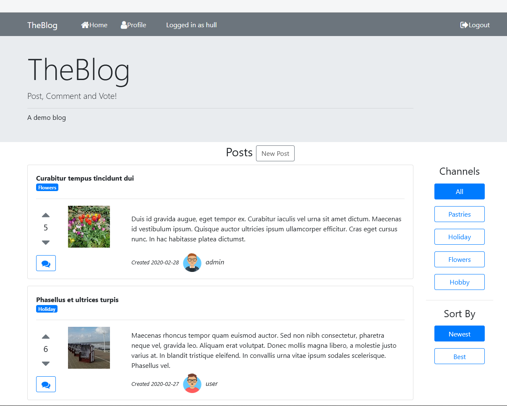

| Build Status  | 
|---|
||

# TheBlog-Angular

An Angular frontend for a demo blog. The backend API server which is used to interact with this frontend can be downloaded from
[here](https://github.com/GregorHue/TheBlog-API).

## Prerequisites

As a prerequisite Node in version 8.9 or higher and npm in version 5.5.1 or higher have to be installed on your computer.

## Installation 

Download or copy the repository into a directory of your choice. Change into this directory, possibly unzip the content and

type on the command line:
   
* `npm install`

## Run

In order to run the application type on the command line:

*  `ng serve` oder `npm start`

The development server will serve the application on `http://localhost:4200`.

## Functionality
This application is the frontend portion of a blog. It provides the common functionality of a blog and includes a roles-based user 
management. 

In detail:

* An anonymous user can read posts and comments.

* A logged-in user can write posts and comments.

* A logged-in user can vote on posts and comments.

* Only the user himself can edit his user profile.

* Only the author of a post or a comment (and the admin) can edit the post or comment, respectivly.

* Only the admin can delete a post, a comment or a user.

* Only the admin can look at the list of users.

* Two predifined users:

  * username `user` with password `user` and role `ROLE_USER`
  
  * username `admin` with password `admin` and `ROLE_ADMIN`

* A new user can signup by hitting the endpoint `localhost:3000/signup` with chosen username and password.

* A user can login by hitting the endpoint `localhost:3000/login` with valid credentials. 

* Display and upload of images
 
## Technology

* Angular application

* Bootstrapped with angular-cli

* State management in services with caching and memoization

* Autorisation and authorization with JSON web token

* Responsive UI with Bootstrap 

## Screenshots

### Home Page

### Create Post

### Create Comment

